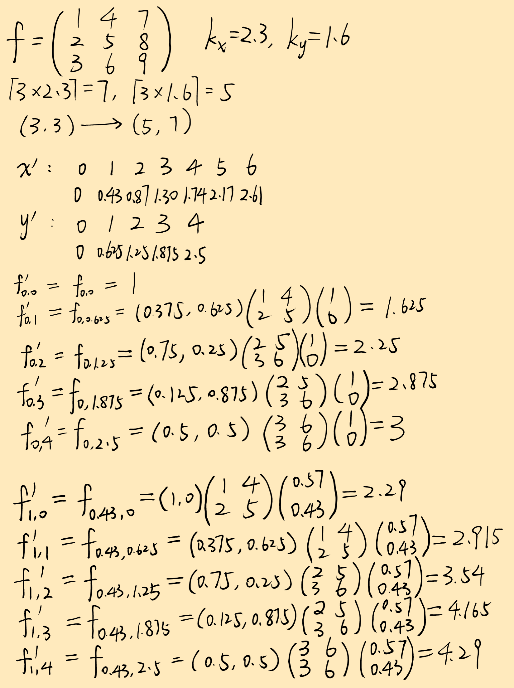
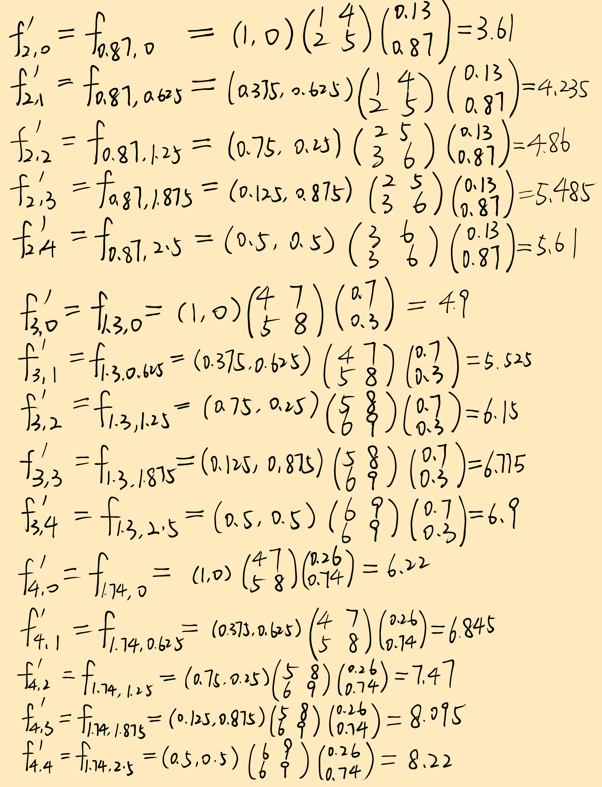
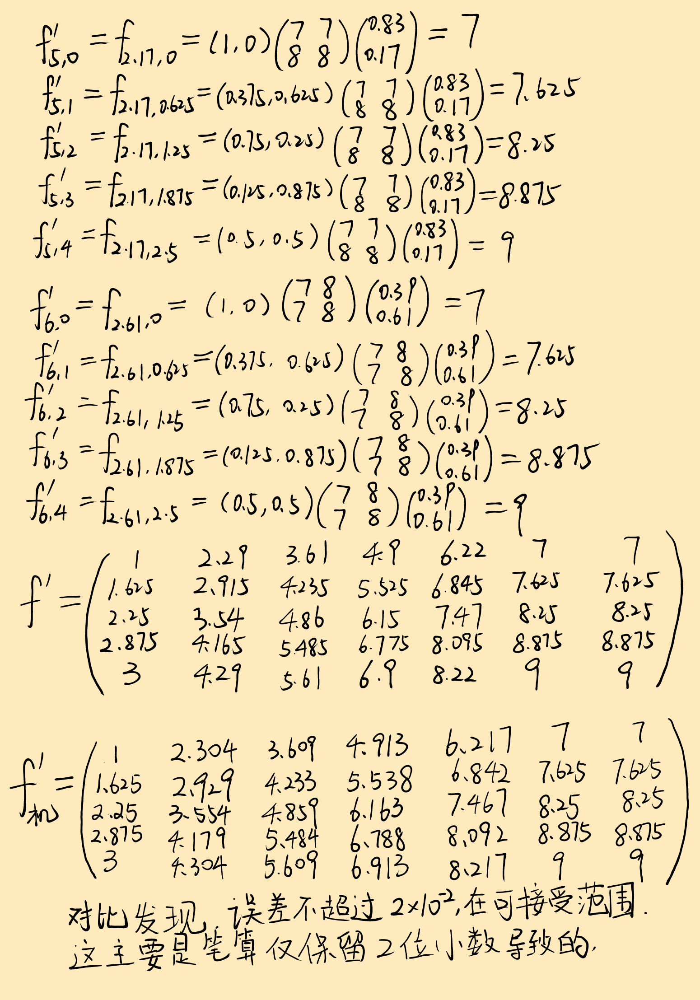
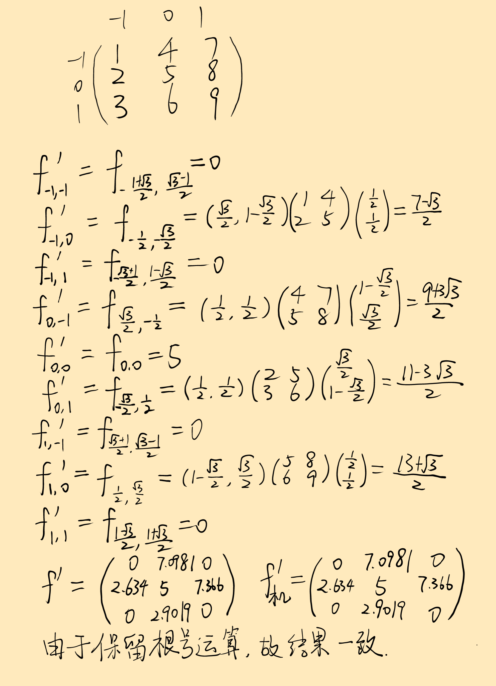
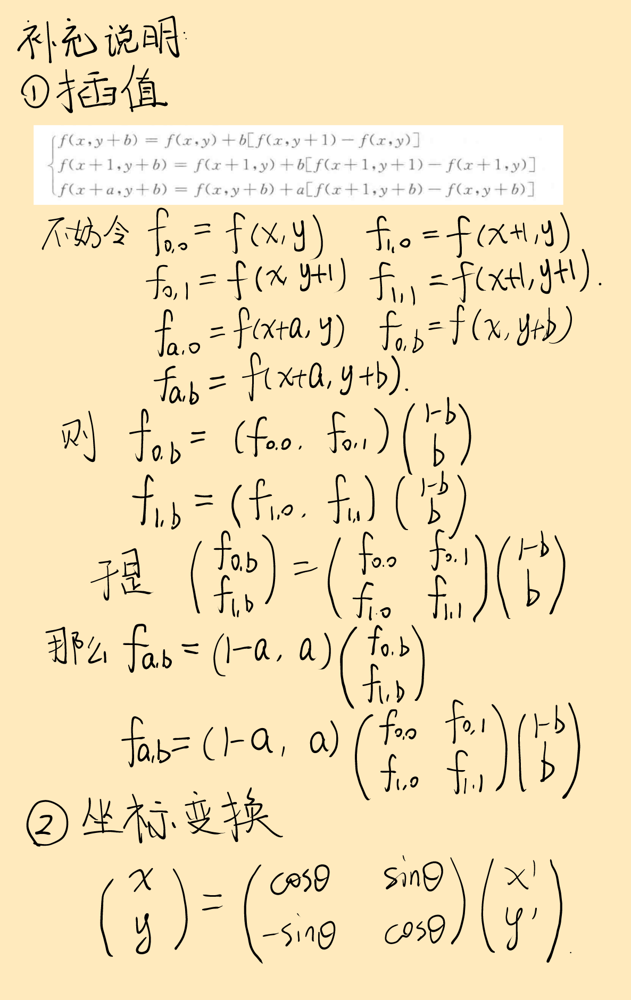

# 19220432陆昊宇第一次作业

[TOC]

## 笔算

#### 2.2


<div style="text-align:center;">
    
    
    
</div>
#### 2.3



#### 补充



## 代码

所有代码可以在[github](https://github.com/Mr-LUHAOYU/Digital_Image_Processing/tree/main/project1)查看.

### python

#### 2.2

```python
import numpy as np
np.set_printoptions(precision=4)

f = np.arange(1, 10).reshape(3, 3).T
kx, ky = 2.3, 1.6

rows, cols = f.shape
new_rows = round(rows * ky)
new_cols = round(cols * kx)
new_f = np.zeros((new_rows, new_cols))

for i in range(new_rows):
    for j in range(new_cols):
        src_x = i / ky
        src_y = j / kx
        x1, y1 = int(src_x), int(src_y)
        x2, y2 = min(x1 + 1, rows - 1), min(y1 + 1, cols - 1)
        dx, dy = src_x - x1, src_y - y1
        new_f[i, j] = (1 - dx) * (1 - dy) * f[x1, y1] + dx * (1 - dy) * f[x2, y1] + \
                      (1 - dx) * dy * f[x1, y2] + dx * dy * f[x2, y2]

print(new_f)
```

#### 2.3

```python
import numpy as np
np.set_printoptions(precision=4)

f = np.arange(1, 10).reshape(3, 3).T
theta = np.radians(60)

rows, cols = f.shape
cx, cy = (cols - 1) / 2, (rows - 1) / 2


def bilinear_interpolate(f, x, y):
    x1, y1 = int(np.floor(x)), int(np.floor(y))
    x2, y2 = min(x1 + 1, cols - 1), min(y1 + 1, rows - 1)

    dx, dy = x - x1, y - y1

    f_xy = (1 - dx) * (1 - dy) * f[y1, x1] + dx * (1 - dy) * f[y1, x2] + \
           (1 - dx) * dy * f[y2, x1] + dx * dy * f[y2, x2]

    return f_xy


new_f = np.zeros_like(f, dtype=np.float32)

for i in range(rows):
    for j in range(cols):
        x_shifted = j - cx
        y_shifted = i - cy

        new_x_shifted = x_shifted * np.cos(theta) - y_shifted * np.sin(theta)
        new_y_shifted = x_shifted * np.sin(theta) + y_shifted * np.cos(theta)

        new_x = new_x_shifted + cx
        new_y = new_y_shifted + cy
        if 0 <= new_x <= cols - 1 and 0 <= new_y <= rows - 1:
            new_f[i, j] = bilinear_interpolate(f, new_x, new_y)

print(new_f)
```

#### 2.4

```python
import numpy as np
from PIL import Image
import matplotlib.pyplot as plt

f = np.array(Image.open('img.png'))


def bilinear_interpolate(f, x, y):
    h, w = f.shape[:2]

    x1, y1 = int(np.floor(x)), int(np.floor(y))
    x2, y2 = min(x1 + 1, w - 1), min(y1 + 1, h - 1)

    dx = x - x1
    dy = y - y1

    value = (1 - dx) * (1 - dy) * f[y1, x1] + dx * (1 - dy) * f[y1, x2] + \
            (1 - dx) * dy * f[y2, x1] + dx * dy * f[y2, x2]

    return value


def show_image(img, title):
    plt.imshow(img.astype(np.uint8))
    plt.title(title)
    plt.axis('off')
    plt.show()


def rotate_image(f, angle):
    h, w = f.shape[:2]
    cx, cy = w / 2, h / 2
    angle_rad = np.radians(angle)

    new_img = np.zeros_like(f)

    for i in range(h):
        for j in range(w):
            x_shifted = j - cx
            y_shifted = i - cy

            new_x_shifted = x_shifted * np.cos(angle_rad) + y_shifted * np.sin(angle_rad)
            new_y_shifted = -x_shifted * np.sin(angle_rad) + y_shifted * np.cos(angle_rad)

            new_x = new_x_shifted + cx
            new_y = new_y_shifted + cy

            if 0 <= new_x <= w - 1 and 0 <= new_y <= h - 1:
                new_img[i, j] = bilinear_interpolate(f, new_x, new_y)

    return new_img


rotated_img = rotate_image(f, 20)
show_image(f, "Original Image")
show_image(rotated_img, "Rotated Image (20°)")


def horizontal_flip(f):
    return f[:, ::-1]


flipped_img = horizontal_flip(rotated_img)
show_image(flipped_img, "Horizontally Flipped Image")


def shear_transform(f, kx, ky):
    h, w = f.shape[:2]

    new_img = np.zeros_like(f)

    for i in range(h):
        for j in range(w):
            new_x = j + kx * i
            new_y = i + ky * j

            if 0 <= new_x < w and 0 <= new_y < h:
                new_img[i, j] = bilinear_interpolate(f, new_x, new_y)

    return new_img


sheared_img = shear_transform(flipped_img, kx=0.3, ky=0.5)
show_image(sheared_img, "Sheared Image (kx=0.3, ky=0.5)")


def scale_image(f, scale_x, scale_y):
    h, w = f.shape[:2]
    new_h, new_w = int(h * scale_y), int(w * scale_x)

    new_img = np.zeros((new_h, new_w, f.shape[2]))

    for i in range(new_h):
        for j in range(new_w):
            src_x = j / scale_x
            src_y = i / scale_y

            new_img[i, j] = bilinear_interpolate(f, src_x, src_y)

    return new_img


scaled_img = scale_image(sheared_img, 0.6, 0.6)
show_image(scaled_img, "Scaled Image (kx=ky=0.6)")

show_image(scaled_img, "Final Transformed Image")
```

### matlab

#### 2.2

```matlab
f = [1 2 3; 4 5 6; 7 8 9]';
kx = 2.3;
ky = 1.6;

[rows, cols] = size(f);
new_rows = round(rows * ky);
new_cols = round(cols * kx);
new_f = zeros(new_rows, new_cols);

for i = 0:new_rows-1
    for j = 0:new_cols-1
        src_x = i / ky;
        src_y = j / kx;

        x1 = floor(src_x);
        y1 = floor(src_y);
        x2 = min(x1 + 1, rows - 1);
        y2 = min(y1 + 1, cols - 1);

        dx = src_x - x1;
        dy = src_y - y1;

        x1=x1+1; x2=x2+1;
        y1=y1+1; y2=y2+1;
        
        new_f(i+1, j+1) = (1 - dx) * (1 - dy) * f(x1, y1) + dx * (1 - dy) * f(x2, y1) + ...
                      (1 - dx) * dy * f(x1, y2) + dx * dy * f(x2, y2);
    end
end

disp(new_f)
```

#### 2.3

```matlab
f = [1 2 3; 4 5 6; 7 8 9]';
theta = 60;
theta_rad = deg2rad(theta);

[rows, cols] = size(f);
cx = (cols - 1) / 2;
cy = (rows - 1) / 2;

new_f = zeros(rows, cols);
for i = 0:rows-1
    for j = 0:cols-1
        x_shifted = j - cx;
        y_shifted = i - cy;

        new_x_shifted = x_shifted * cos(theta_rad) - y_shifted * sin(theta_rad);
        new_y_shifted = x_shifted * sin(theta_rad) + y_shifted * cos(theta_rad);
        
        new_x = new_x_shifted + cx;
        new_y = new_y_shifted + cy;
        
        if new_x >= 0 && new_x <= cols-1 && new_y >= 0 && new_y <= rows-1
            new_f(i+1, j+1) = bilinear_interpolate(f, new_x, new_y, rows, cols);
        end
    end
end

disp(new_f);


function value = bilinear_interpolate(f, x, y, rows, cols)
    x1 = floor(x); y1 = floor(y);
    x2 = min(x1 + 1, cols-1); y2 = min(y1 + 1, rows-1);
    
    dx = x - x1;
    dy = y - y1;
    
    value = (1 - dx) * (1 - dy) * f(y1+1, x1+1) + dx * (1 - dy) * f(y1+1, x2+1) + ...
            (1 - dx) * dy * f(y2+1, x1+1) + dx * dy * f(y2+1, x2+1);
end

```

#### 2.4

```matlab
f = imread('img.png');
[rows, cols, channels] = size(f);

rotated_img = rotate_image(f, 20);
show_image(f, 'Original Image');
show_image(rotated_img, 'Rotated Image (20°)');
flipped_img = horizontal_flip(rotated_img);
show_image(flipped_img, 'Horizontally Flipped Image');
sheared_img = shear_transform(flipped_img, 0.3, 0.5);
show_image(sheared_img, 'Sheared Image (kx=0.3, ky=0.5)');
scaled_img = scale_image(sheared_img, 0.6, 0.6);
show_image(scaled_img, 'Scaled Image (kx=ky=0.6)');
show_image(scaled_img, 'Final Transformed Image');

function value = bilinear_interpolate(f, x, y, rows, cols)
    if x < 0 || x >= cols - 1 || y < 0 || y >= rows - 1
        value = 0;
        return;
    end

    x1 = floor(x); y1 = floor(y);
    x2 = min(x1 + 1, cols - 1); y2 = min(y1 + 1, rows - 1);

    dx = x - x1;
    dy = y - y1;

    value = (1 - dx) * (1 - dy) * double(f(y1 + 1, x1 + 1, :)) + ...
             dx * (1 - dy) * double(f(y1 + 1, x2 + 1, :)) + ...
             (1 - dx) * dy * double(f(y2 + 1, x1 + 1, :)) + ...
             dx * dy * double(f(y2 + 1, x2 + 1, :));
end

function show_image(img, title_str)
    figure;
    imshow(uint8(img));
    title(title_str);
end

function rotated_img = rotate_image(f, angle)
    [rows, cols, channels] = size(f);
    cx = (cols - 1) / 2;
    cy = (rows - 1) / 2;
    angle_rad = deg2rad(angle);

    rotated_img = ones(rows, cols, channels) * 255;

    for i = 0:rows-1
        for j = 0:cols-1
            x_shifted = j - cx;
            y_shifted = i - cy;

            new_x_shifted = x_shifted * cos(angle_rad) + y_shifted * sin(angle_rad);
            new_y_shifted = -x_shifted * sin(angle_rad) + y_shifted * cos(angle_rad);

            new_x = new_x_shifted + cx;
            new_y = new_y_shifted + cy;

            if new_x >= 0 && new_x <= cols-1 && new_y >= 0 && new_y <= rows-1
                rotated_img(i + 1, j + 1, :) = bilinear_interpolate(f, new_x, new_y, rows, cols);
            end
        end
    end
end

function flipped_img = horizontal_flip(f)
    flipped_img = f(:, end:-1:1, :);
end


function sheared_img = shear_transform(f, kx, ky)
    [rows, cols, channels] = size(f);
    sheared_img = ones(rows, cols, channels) * 255;

    for i = 0:rows-1
        for j = 0:cols-1
            new_x = j + kx * i;
            new_y = i + ky * j;

            if new_x >= 0 && new_x <= cols-1 && new_y >= 0 && new_y <= rows-1
                sheared_img(i + 1, j + 1, :) = bilinear_interpolate(f, new_x, new_y, rows, cols);
            end
        end
    end
end


function scaled_img = scale_image(f, scale_x, scale_y)
    [rows, cols, channels] = size(f);
    new_rows = round(rows * scale_y);
    new_cols = round(cols * scale_x);

    scaled_img = ones(new_rows, new_cols, channels) * 255;

    for i = 0:new_rows-1
        for j = 0:new_cols-1
            src_x = j / scale_x;
            src_y = i / scale_y;

            if src_x >= 0 && src_x <= cols-1 && src_y >= 0 && src_y <= rows-1
                scaled_img(i + 1, j + 1, :) = bilinear_interpolate(f, src_x, src_y, rows, cols);
            end
        end
    end
end
```


