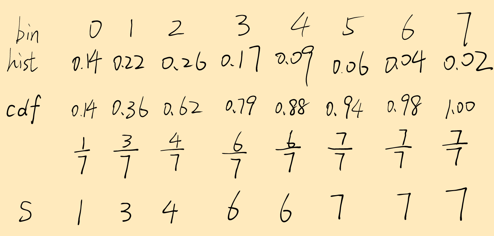
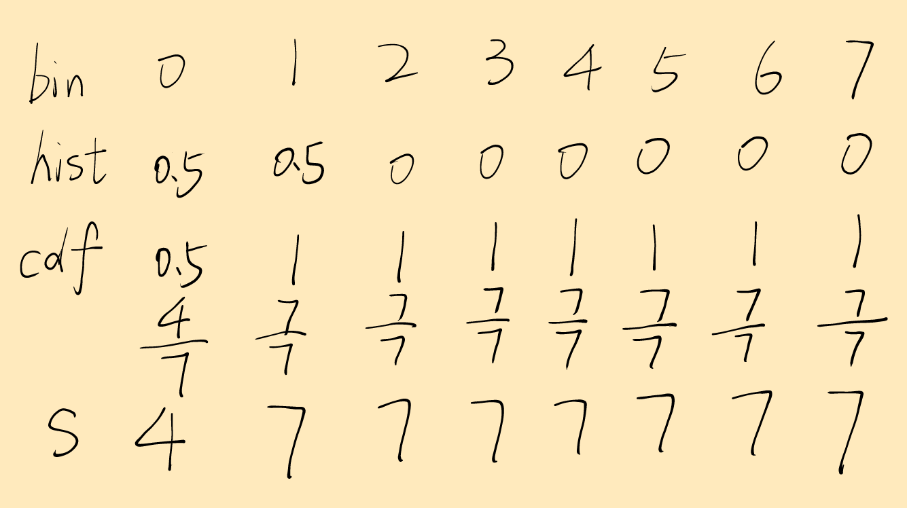
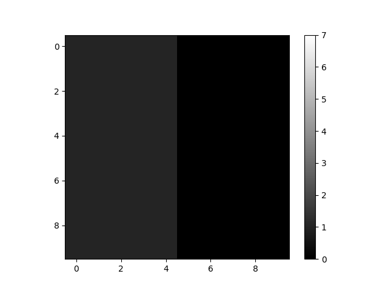
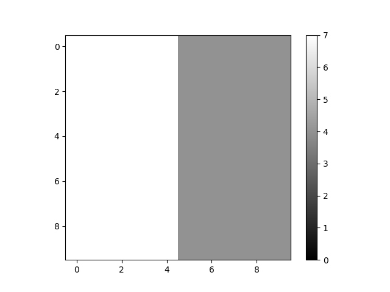
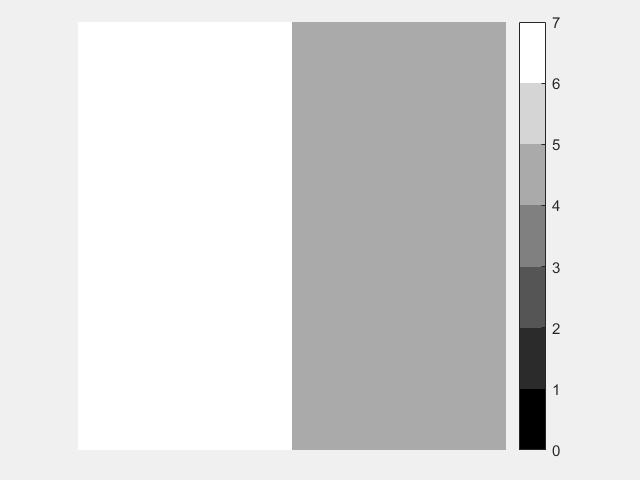

# 19220432陆昊宇第二次作业

[TOC]

## 原理

直方图均衡化是一种用于增强图像对比度的技术,特别适用于光照不均匀的图像.其核心思想是通过调整图像的灰度值分布,使其更加均匀,从而改善图像的可视化效果.

### 直方图均衡化的原理
1. **统计灰度直方图**：首先计算图像的灰度直方图,即统计每个灰度级（例如0到255,针对8位灰度图像）在图像中出现的频率.

2. **计算累积分布函数（CDF）**：利用灰度直方图计算每个灰度值的累积分布函数（Cumulative Distribution Function,CDF）.累积分布函数是直方图中各灰度级出现频率的累积和,它是图像灰度分布的累积概率.

3. **映射灰度值**：通过累积分布函数,将原始图像的灰度值映射到一个新的灰度值范围中.例如,灰度值较低的像素可能被映射到更高的灰度值,从而使暗部细节更加突出；同理,灰度值较高的像素也可能被调整,从而降低高光区域的饱和度.

4. **生成均衡化图像**：通过灰度值映射,将原图的灰度级重新分配,从而得到对比度更高的均衡化图像.

### 公式描述
设原始图像灰度值的范围为 $[0, L-1]$（对于8位图像, $L=256$ ）,灰度值为 $( r )$ 的累积分布函数 $CDF(r)$ 定义为：

$CDF(r) = \sum_{k=0}^{r} P_r(k)$

其中 $P_r(k)$ 是灰度值 $k$ 出现的概率.

将每个原始灰度值 $( r )$ 通过以下公式映射为新灰度值 $s$：

$s = (L - 1) \times CDF(r)$

这个映射使得图像的灰度级分布尽可能接近均匀分布,从而提高对比度.

### 直方图均衡化的效果
- **增强对比度**：使得图像中原本对比度不明显的区域更加清晰,尤其是暗部和亮部细节得到更好展现.
- **应用场景**：适用于光照不均匀的图像,如医学图像、卫星图像等,有助于人眼或计算机视觉系统更容易识别细节.

## 笔算

#### 5.4



#### 5.5



效果：整体变亮, 对比度更加明显.

## 上机验证

#### 5.4


#### 5.5

<div style="text-align:center;">
	<p> python </p>
    
    
</div>

<div style="text-align:center;">
	<p> matlab </p>
    
    
</div>

## 代码

所有代码可以在[github](https://github.com/Mr-LUHAOYU/Digital_Image_Processing/tree/main/project2)查看.

### python

#### 5.4

```python
import numpy as np

hist = [560, 920, 1046, 705, 356, 267, 170, 72]
bins = [0, 1, 2, 3, 4, 5, 6, 7]

hist = np.array(hist)
bins = np.array(bins)
k = np.max(bins)

cdf = hist[:] / np.sum(hist) * k
cdf = np.cumsum(cdf)
cdf = np.round(cdf).astype(int)
print(cdf)

```

#### 5.5

```python
import numpy as np
from matplotlib import pyplot as plt


def display(image):
    plt.imshow(image, cmap='gray', vmin=0, vmax=7)
    plt.colorbar()
    plt.show()


n, m, k = 10, 10, 7
img = [[1] * m for _ in range(n // 2)] + [[0] * m for _ in range(n // 2)]
img = np.array(img).T

display(img)

hist, bins = np.histogram(img.flatten(), bins=k, range=(0, k))

cdf = hist / np.sum(hist) * k
cdf = np.cumsum(cdf)
cdf = np.round(cdf).astype(int)
img_new = cdf[img]

display(img_new)

```

### matlab

#### 5.4

```matlab
hist = [560, 920, 1046, 705, 356, 267, 170, 72;];
bins = [0, 1, 2, 3, 4, 5, 6, 7;];

cdf = hist / sum(hist) * max(bins);

cdf = cumsum(cdf);

cdf = round(cdf);
disp(cdf);

```

#### 5.5

```matlab
function histogram_equalization_example()
    n = 10; 
    m = 10; 
    k = 7;

    img = [ones(n/2, m); zeros(n/2, m)];
    img = img';

    display(img, k);
    
    hist = histcounts(img, 0:k);

    cdf = hist / sum(hist) * k;
    
    cdf = cumsum(cdf);
    
    cdf = round(cdf);
    
    img_new = cdf(img + 1);

    display(img_new, k)
end

function display(image, k)
    figure;
    imshow(image, [0 k], 'InitialMagnification', 'fit');
    colormap(gray(k));
    colorbar;
end

```
